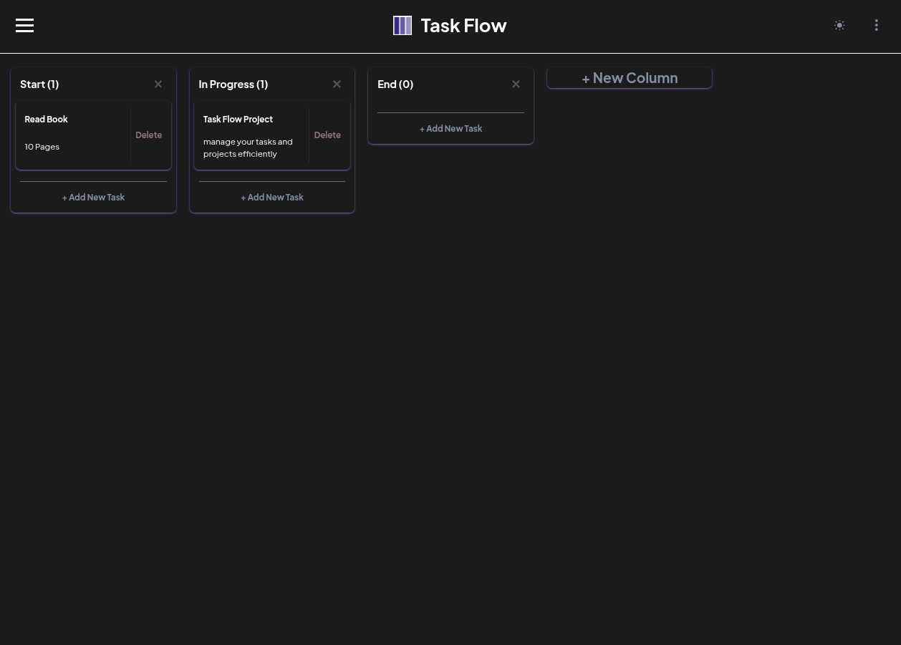

# Task Flow: Simple and Efficient

Task Flow is a simple and intuitive application designed to help you manage your tasks and projects efficiently. This application allows you to create multiple boards, organize tasks into customizable columns, and easily move tasks and columns using drag-and-drop functionality. All your data is saved locally in the browser, ensuring your work remains secure and organized.

## 🌟 Features

- **Board Management:**
  - Create, edit, and delete multiple boards to organize different projects.
  - Easily navigate between active boards.
- **Column Organization:**
  - Add, rename, and delete columns within each board.
  - **Reorder columns via drag-and-drop.**
- **Task Management:**
  - Create new tasks within any column.
  - Edit task title and description directly on the card.
  - Delete individual tasks.
  - **Move tasks between columns via drag-and-drop.**
- **Local Data Storage:** All your board and task data is automatically saved to your browser's Local Storage, ensuring your data persists even after closing the browser.
- **Dark/Light Mode:** Switch between dark and light themes for a comfortable and personalized viewing experience.
- **Responsive Design:** The application is optimized to work seamlessly across various screen sizes, from mobile phones to desktop computers.

## 📸 Screenshots

| Feature               | Screenshot                                                 |
| --------------------- | ---------------------------------------------------------- |
| **Create New Board**  |  |
| **Dark Mode**         |                     |
| **Delete Board**      |            |
| **Drag and Drop**     |                      |
| **Edit Board**        |                |
| **Light Mode**        |                   |
| **Side Menu**         |                       |
| **Responsive Design** |           |

## 🚀 Technologies Used

This project was built using modern technologies to deliver a smooth and efficient user experience:

- [**React.js**](https://react.dev/): JavaScript library for building user interfaces.
- [**Tailwind CSS**](https://tailwindcss.com/): A CSS framework for rapidly building responsive designs.
- [**use-immer**](https://immerjs.github.io/immer/): A helper library for immutable state management in React.
- [**@dnd-kit**](https://dndkit.com/): A powerful and customizable toolkit for drag-and-drop functionalities **for both tasks and columns**.
- [**Radix UI**](https://www.radix-ui.com/): A primitive UI component library for creating accessible components (e.g., Dialog and Dropdown Menu).
- [**Class Variance Authority (cva)**](https://www.google.com/search?q=https://cva.dev/): A tool for creating reusable UI components with design variants.
- [**Hamburger React**](https://hamburger-react.netlify.app/): A simple React component for an animated hamburger menu icon.

## 🛠️ Getting Started

Follow these steps to set up and run Task Flow on your local machine.

### Prerequisites

Make sure you have the following installed on your system:

- [Node.js](https://nodejs.org/en/) (version 14 or newer recommended)
- [npm](https://www.npmjs.com/) or [Yarn](https://yarnpkg.com/)

### Installation

1.  **Clone the repository:**

    ```
    git clone [https://github.com/your-username/task-flow.git](https://github.com/your-username/task-flow.git)
    cd task-flow
    ```

    _(Make sure to replace `https://github.com/your-username/task-flow.git` with your actual repository link)_

2.  **Install dependencies:**
    ```
    npm install
    # or
    yarn install
    ```

### Running the Application

After installing the dependencies, you can run the application in development mode:

    ```
    npm run dev
    # or
    yarn dev
    ```

The application will be available at `http://localhost:5173` (or a similar port). Open this link in your browser.
